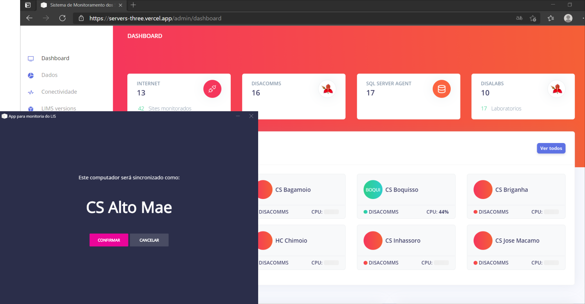
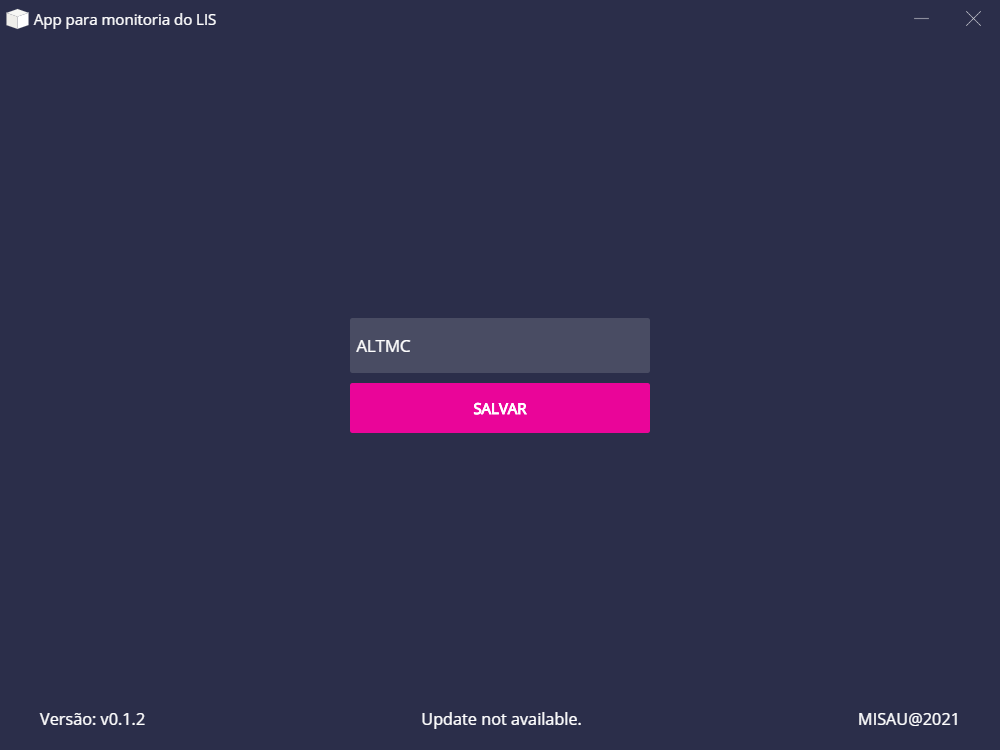
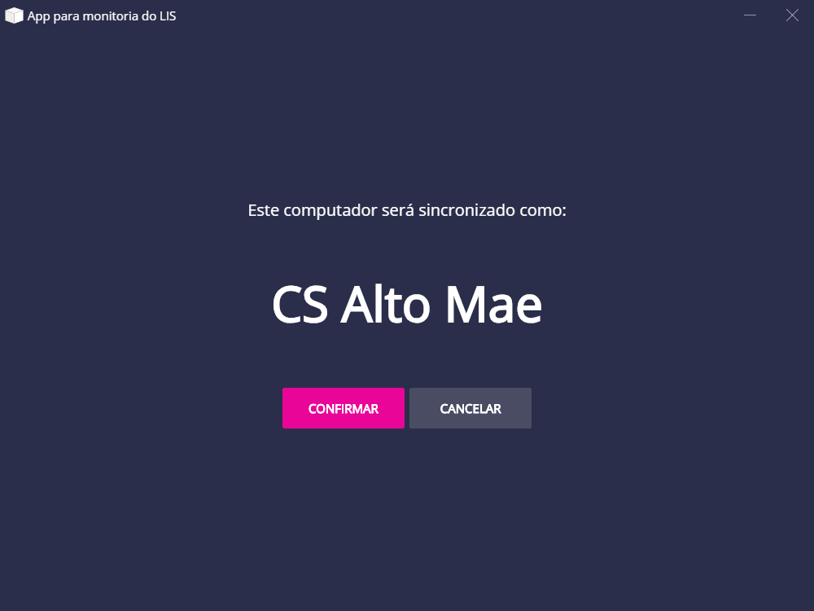
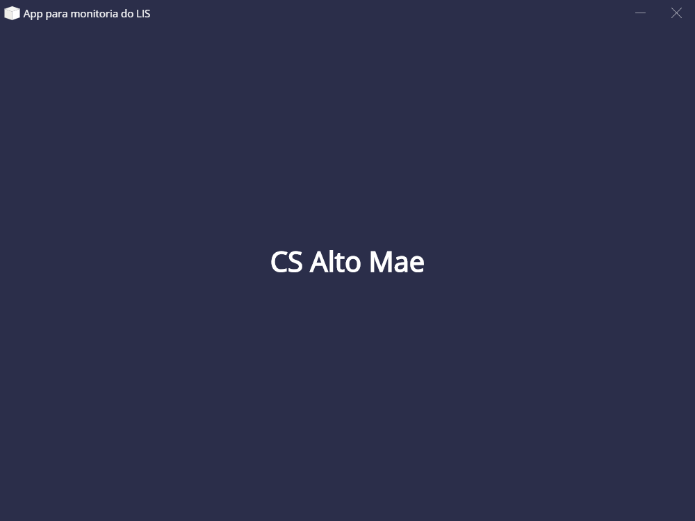
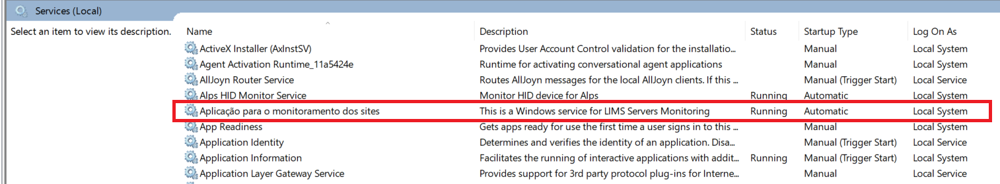

[Esta é a aplicação](https://servers-three.vercel.app/admin/dashboard/ "Download") para a monitoria dos servidores e computadores instalados nas Unidades Sanitárias e Laboratórios para a implementação do LIS.
Esta documentação visa descrever o processo de instalação do aplicativo que fará o monitoramento dos computadores.

## Download

A aplicação a ser instalada pode ser baixada [neste link](https://drive.google.com/file/d/1XXPIrZr0H1IpbWMPgf2983-iTz0nir0M/view?usp=sharing "Download").

## Habilitar Acesso Remoto no SQL

Antes de efectuar a instalação do aplicativo é necessário habilitar o acesso remoto para o Servidor SQL Server. Para tal, basta executar o seguinte comando TSQL no MSSQL Management Studio.
```SQL
EXEC sp_configure 'remote access', 0 ;  
GO  
RECONFIGURE ;  
GO  
```

## Instalação

Após o download, para a instalar o aplicativo é necessário executar o instalador com privilégios Administrativos.

## Configuração

Uma vez instalado o aplicativo, deve-se inserir o código da Unidade Sanitária (código do DISA). Por exemplo a figura que segue ilustra o processo de instalação do _Centro de Saúde_ Alto-maé cujo código é ALTMC.


Caso o código inserido seja válido, será visualizado o nome da Unidade Sanitária a que pertence o computador, para a sua confirmação.


Por fim será visualizada a mensagem de confirmação da sincronização.


## Verificação
Durante a instalação, o aplicativo irá criar um serviço no Sistema Operativo que será responsável pela sincronização do computador. O servico criado tera o nome de `Aplicação para o monitoramento dos sites` e deverá estar sempre a correr. Este pode ser encontrado na aplicação do `Windows service`.


Para verificar a conectividade do computador configurado basta aceder ao link que segue e substituir o código da Unidade Santária `<codigo da US>`.

`https://servers-three.vercel.app/admin/servers/<codigo da US>`
